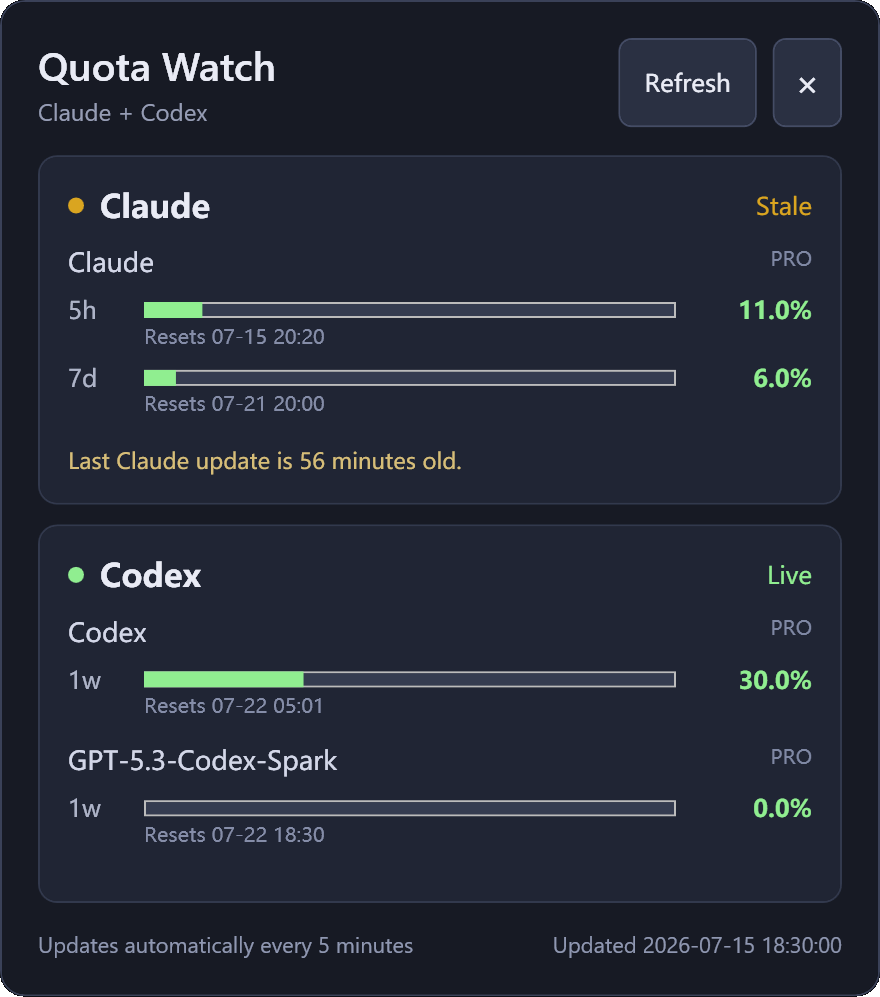

# Quota Watch

[](https://github.com/lazydao/quota-watch/actions/workflows/ci.yml)

Terminal quota monitor for Claude Code and Codex. It reads the sessions already authenticated by the official local CLIs and does not store provider credentials.

<p align="center">
  
</p>

## Features

- One-shot terminal dashboard with `quota`
- Auto-refreshing dashboard with `quota watch`
- Windows notification-area app with a click-to-open quota flyout
- Machine-readable output with `quota --json`
- Multi-bucket Codex quota support through `rateLimitsByLimitId`
- Claude 5-hour and 7-day quota support through its local status-line JSON
- Claude and Codex subscription-plan labels when their official CLIs expose them
- No browser cookies, OAuth tokens, API keys, or session keys in the cache

## Install

Requires Python 3.10 or later, Claude Code, and/or Codex.

```powershell
py -3.10 -m venv .venv
.venv\Scripts\python -m pip install -e .
```

For an isolated global command, you can also use pipx:

```powershell
pipx install git+https://github.com/lazydao/quota-watch.git
```

## Usage

```powershell
quota
quota --json
quota watch --interval 30
```

Watch mode uses the terminal's alternate screen and replaces the completed dashboard in place. Resizing the terminal redraws the current dashboard without querying the providers again. Press `Ctrl+C` to return to the original terminal contents.

### Windows notification-area app

Quota Watch includes an optional Windows companion under `windows/QuotaWatch.Tray`. It keeps a small icon in the notification area instead of occupying a normal taskbar button.

- Left-click the icon to toggle the quota flyout.
- Click elsewhere, press `Esc`, or click the close button to hide the flyout.
- Right-click the icon to refresh, open the terminal dashboard, enable launch at sign-in, or exit.
- The last successful snapshot is shown immediately while a refresh runs in the background.
- Quotas refresh automatically every five minutes.

The tray app calls the installed `quota --json` command without opening a console window, so it reuses the same Claude cache, WSL bridge, Codex discovery, and provider authentication as the CLI. Set `QUOTA_WATCH_CLI_PATH` if the `quota` executable is not on `PATH`.

Run it from source on Windows with the .NET 8 SDK:

```powershell
dotnet run --project windows\QuotaWatch.Tray
```

Create a self-contained Windows executable:

```powershell
.\windows\publish.ps1
```

The default output is `windows\artifacts\QuotaWatch.Tray-win-x64\QuotaWatch.Tray.exe`. Windows can initially place a new icon in the notification-area overflow; pin it from Windows taskbar settings if you want it to remain visible.

### Releases

The `Release` GitHub Actions workflow builds the Windows tray app on a Windows runner, runs its smoke tests, and packages the self-contained executable with the README and license. A manual workflow run uploads a 14-day Actions artifact without publishing a release.

To publish a GitHub Release, update the matching versions in `pyproject.toml` and `windows\QuotaWatch.Tray\QuotaWatch.Tray.csproj`, then push a tag such as `v0.1.5`:

```powershell
git tag -a v0.1.5 -m "Quota Watch v0.1.5"
git push origin v0.1.5
```

The workflow rejects a tag whose version does not match either project. Successful tag builds publish `quota-watch-tray-v0.1.5-win-x64.zip` and its SHA-256 checksum to the GitHub Release.

### Connect Claude Code

Claude Code exposes quota percentages and reset timestamps to local status-line commands. Configure the bridge once:

```powershell
quota setup-claude
```

Then start or continue a Claude Code session. Quota Watch stores only the filtered quota snapshot under the user's local cache directory.

Quota Watch reads Claude's subscription label from the official `claude auth status --json` command. On Windows it tries the local Claude install first, then the default WSL distribution. Only `subscriptionType` is retained; account and organization details are discarded.

Claude Code may omit `rate_limits` before the first model response. During that normal startup window, the bridge waits quietly or displays the last cached quota instead of reporting an error.

If Claude Code already has a custom `statusLine`, `quota setup-claude` leaves it untouched and prints the command that needs to be chained into the existing setup.

Use `quota setup-claude --dry-run` to inspect the change without writing it.

#### Claude Code in WSL

When the dashboard runs on Windows but Claude Code runs in WSL, connect the default distribution with:

```powershell
quota setup-claude --wsl
```

Select a non-default distribution with `--distro`, and preview all changes with `--dry-run`:

```powershell
quota setup-claude --wsl --distro Debian --dry-run
```

The setup creates a small wrapper under the WSL user's `~/.claude` directory. If a custom status line already exists, its output is preserved and the original settings file is backed up before the wrapper is enabled. WSL forwards only the status-line JSON to the Windows `quota.exe`, so both environments share the same filtered quota cache.

### Codex

No additional setup is needed. Quota Watch locates the official local Codex executable, launches `codex app-server`, and calls `account/rateLimits/read` over JSONL stdio. The adapter displays every quota bucket returned by the installed Codex version.

Executable discovery prefers the official standalone Windows install, then the Codex Desktop bundled CLI, then `codex` on `PATH` (including npm installs).

Set `QUOTA_WATCH_CODEX_PATH` when Codex is installed in a non-standard location.

## Data flow

```text
Claude Code -- status-line JSON --> filtered local cache --+
                                                          +--> quota / quota watch
Codex CLI ---- app-server JSON-RPC ------------------------+
```

Claude data can be marked stale when no Claude Code session has refreshed the status line recently. Codex App Server is currently an experimental interface, so Quota Watch keeps that protocol behind an isolated adapter.

Protocol references: [Claude Code status line](https://code.claude.com/docs/en/statusline), [Codex App Server](https://developers.openai.com/codex/app-server/), and [Codex CLI installation](https://github.com/openai/codex#installing-and-running-codex-cli).

## Development

```powershell
python -m pip install -e .
python -m unittest discover -s tests -v
dotnet build windows\QuotaWatch.Tray\QuotaWatch.Tray.csproj --configuration Release
dotnet run --project windows\QuotaWatch.Tray.Tests\QuotaWatch.Tray.Tests.csproj --configuration Release
```

## License

MIT
